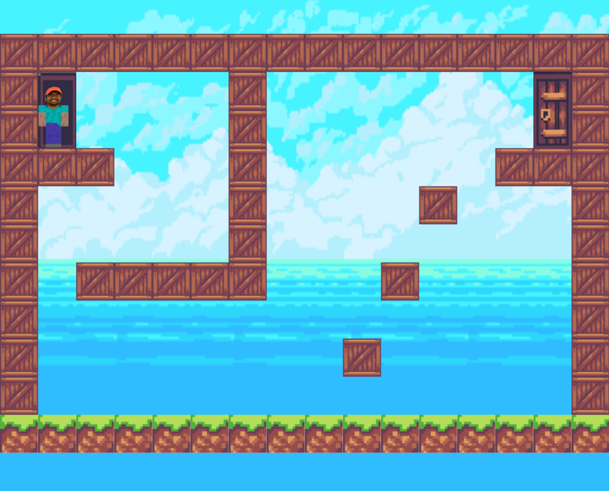

# Mohan Jump

A simple platformer in vanilla JS.

#### Running Mohan Jump

In a browser, open `file://<path-to-src/main.html>`.

#### Playing the game

* Use `UP`/`DOWN`/`LEFT`/`RIGHT`, `SPACE`, or `W` `A` `S` `D` to move the player around.
* **Reach the door at the end of the level to win!**
